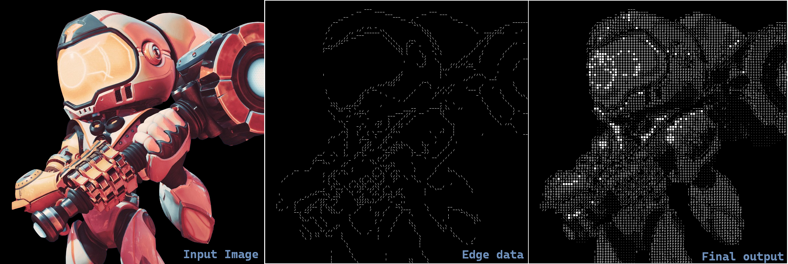
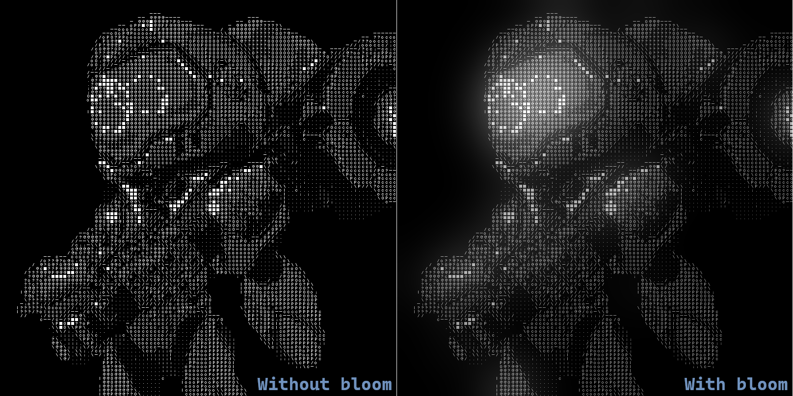

# ASCII art generator

- A small scoped and fun project that converts an image into ASCII art. Inspired by [Acerola's](https://www.youtube.com/@Acerola_t) video on turning video games into text using HLSL.
- This implementation is based on Python and it uses matplotlib for image loading/storing and numpy for processing.

## This project uses following methods for implementation

- Image downsampling and upsampling.
- Image quantization.
- Sobel filter for edge detection using atan2 to find angles and mapping it to corresponding slash character.
- Difference of gaussian to enhance edge detection that acts as a preprocessor to sobel filter to reduce noise.
- Image thresholding and gaussian blur to achieve bloom effect.

## Output

### Processing stages

### Optional bloom

## Future work

- This implementation is very slow because it uses python and all processing is done on CPU sequentially.
- Next step would be to parallelize the processing using GPU.
- I have started implemeting parallel implementation using CUDA C.

## References

- [Acerola's video](https://youtu.be/gg40RWiaHRY?si=Ht_5jxvlYIw1IgLJ)
- [Paper on difference of gaussian](https://users.cs.northwestern.edu/~sco590/winnemoeller-cag2012.pdf)
