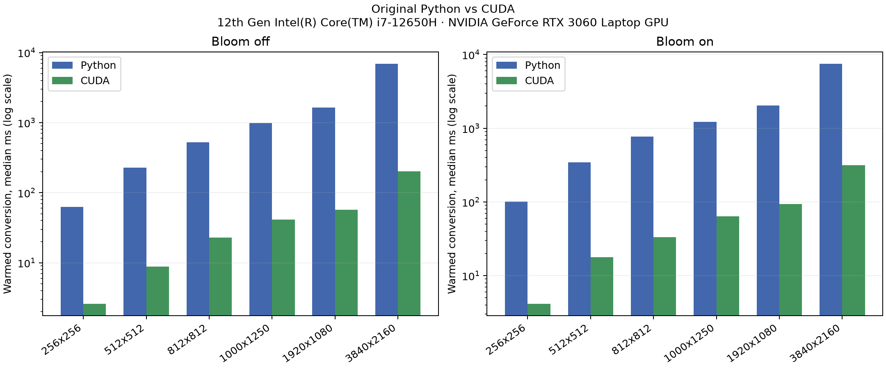
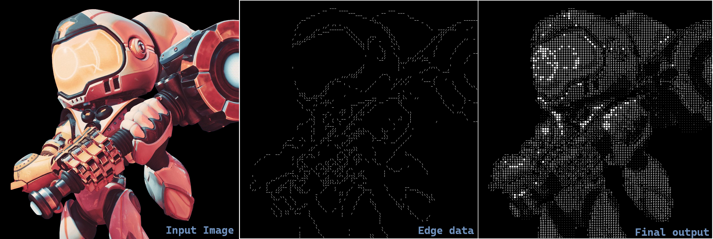
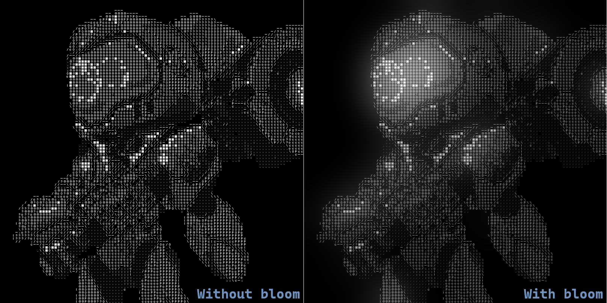

# ASCII art generator

- A small scoped and fun project that converts an image into ASCII art. Inspired by [Acerola's](https://www.youtube.com/@Acerola_t) video on turning video games into text using HLSL.
- The original Python implementation uses matplotlib, NumPy, and SciPy. A complete CUDA C implementation is available in [`cuda/`](./cuda/), with a C command-line interface and a reusable C API.

## Python version

Create an isolated environment with Python 3.12 or later and the package versions used for the published benchmarks:

```sh
python3 -m venv .venv
.venv/bin/python -m pip install -r requirements.txt
.venv/bin/python main.py images/sample_resize.png output/python_final.png
.venv/bin/python main.py images/sample_resize.png output/python_no_bloom.png --no-bloom
```

[`AsciiArt.py`](./AsciiArt.py) retains the original algorithm. [`main.py`](./main.py) supplies a headless CLI with optional `--edges-output`, `--fill-output`, and machine-readable `--metrics-json` timing data. Running it without arguments retains the original sample-image workflow. Both CLIs use the same atlases and default processing settings; output directories must already exist.

## Benchmarks

The [benchmark report](./BENCHMARKS.md) compares the original Python implementation and CUDA on six image sizes from 256×256 through 3840×2160, with bloom off and on. It includes fresh-process latency, warmed conversion latency, variability, throughput, stage profiles, memory, and decoded output agreement. [Raw measurements](./benchmarks/results/results.json), [all summary statistics](./benchmarks/results/summary.csv), and the profiling summaries accompany the report.

Measured on an i7-12650H and RTX 3060 Laptop GPU, warmed end-to-end conversion is **19.19–34.26× faster** with CUDA across this suite. Representative median times include loading, processing, saving, and cleanup:

| Input | Bloom | Python | CUDA | Speedup |
| --- | --- | ---: | ---: | ---: |
| 1920×1080 | off | 1,631.72 ms | 56.85 ms | 28.70× |
| 1920×1080 | on | 2,033.09 ms | 93.20 ms | 21.81× |
| 3840×2160 | off | 6,905.57 ms | 201.57 ms | 34.26× |
| 3840×2160 | on | 7,490.71 ms | 315.60 ms | 23.73× |

Fresh-process speedups are smaller because they include Python imports or CUDA context startup. No-bloom outputs match Python exactly in every measured case; all bloom output pixels differ by at most two intensity levels. The report documents timing boundaries, the desktop GPU workload, and other limits on interpreting these results.

To reproduce the measurements on a Linux machine with a working GPU:

```sh
.venv/bin/python benchmarks/run.py
```

The default suite uses one warmup, five measured conversions, three fresh-process runs, and separate CUDA stage-event profiles. It also captures Python cProfile and NVIDIA Nsight Systems summaries for 1080p. Use `--skip-profilers` when Nsight is unavailable, or `--sizes 512x512,1920x1080` for a shorter suite. The script records environment metadata, source/input hashes, settings, exact worker commands, and every sample, then generates `BENCHMARKS.md` and a standalone plot. Timings are measured on the local GPU; no estimated speedups are used.



## Build the CUDA version

Requirements:

- An NVIDIA GPU with a working CUDA driver for execution.
- CUDA Toolkit with `nvcc`, a compatible C/C++ host compiler, and CMake 3.24 or later. CUDA compiles `.cu` files through its C++ frontend; the host interface and image I/O are C, and the kernels use C-style code.
- libpng and libjpeg development packages (`libpng-dev` and `libjpeg-dev` on Debian/Ubuntu).

From the repository root:

```sh
cmake -S . -B build -DCMAKE_BUILD_TYPE=Release
cmake --build build -j
```

The default build targets compute capabilities 7.5, 8.0, 8.6, 8.9, and 9.0, with PTX for the highest target. To select your GPU architecture or use another toolkit:

```sh
cmake -S . -B build -DCMAKE_BUILD_TYPE=Release \
  -DCMAKE_CUDA_ARCHITECTURES=86 \
  -DCMAKE_CUDA_COMPILER=/usr/local/cuda/bin/nvcc
cmake --build build -j
```

Use an architecture supported by both your GPU and toolkit. Building does not require an attached GPU; running the converter does.

## Run

```sh
# Same settings as main.py, including bloom.
./build/ascii_cuda images/sample_resize.png output/cuda_final_with_bloom.png

# Save the stages and disable bloom.
./build/ascii_cuda images/sample_resize.png output/cuda_final.png \
  --no-bloom \
  --edges-output output/cuda_edges.png \
  --fill-output output/cuda_fill.png

# JPEG input and custom settings.
./build/ascii_cuda input.jpg output/custom.png \
  --sigma 1.5 --edge-votes 8 --bloom-sigma 20

./build/ascii_cuda --help
```

Input can be PNG or RGB/grayscale JPEG, including grayscale PNG and PNG with alpha. The decoder converts to RGB8 and ignores alpha, matching the original converter's use of RGB channels. Output is an 8-bit grayscale PNG, regardless of the output filename extension. Output directories must already exist. Run from the repository root, or provide `--fill-atlas` and `--edge-atlas` paths explicitly.

Output dimensions are `floor(input_width / glyph_size) * glyph_size` by `floor(input_height / glyph_size) * glyph_size`. Incomplete cells at the right and bottom are cropped; an input smaller than one glyph is rejected. For example, the 812×812 sample produces an 808×808 image with the included 8×8 glyphs.

| Option | Default | Effect |
| --- | --- | --- |
| `--fill-atlas PATH` | `res/fillASCII.png` | Horizontal strip of fill glyphs, ordered by brightness |
| `--edge-atlas PATH` | `res/edgesASCII.png` | Edge glyph strip in the existing atlas order |
| `--sigma VALUE` | `2` | Narrow Gaussian standard deviation |
| `--scale VALUE` | `1.6` | Wide Gaussian sigma multiplier |
| `--tau VALUE` | `1` | Weight in `(1 + tau) * narrow - tau * wide` |
| `--dog-threshold VALUE` | `0.3` | Binarization threshold before Sobel |
| `--magnitude-threshold VALUE` | `0` | Minimum accepted Sobel magnitude |
| `--edge-votes INTEGER` | `12` | A direction needs strictly more than this many votes |
| `--bloom-threshold VALUE` | `0.8` | Bright-pass cutoff, applied before blur |
| `--bloom-sigma VALUE` | `50` | Bloom Gaussian standard deviation |
| `--no-bloom` | Bloom enabled | Disable the bright pass, blur, and addition |
| `--fixed-range` | Per-image min/max normalization | Clamp intensities to `[0, 1]` instead |
| `--device INTEGER` | `0` | CUDA device ordinal |
| `--edges-output PATH` | Disabled | Save rendered edge glyphs |
| `--fill-output PATH` | Disabled | Save rendered fill glyphs before composition |

Gaussian sigmas, including `sigma * scale`, must be in `(0, 1024]`. Scale must be positive, tau in `[0, 1000000]`, magnitude and vote thresholds nonnegative, and bloom threshold in `[0, 1]`. Non-finite numeric values are rejected. Very wide blurs are supported but require more work.

## CUDA pipeline and compatibility

All image processing runs on the GPU: luminance conversion, both separable Gaussian blurs, DoG thresholding, Sobel direction classification, per-cell voting, luminance quantization, glyph rendering, edge/fill composition, bloom, and output normalization. The CPU handles command-line parsing, PNG/JPEG decoding and encoding, Gaussian coefficient generation, and atlas metadata. Image buffers stay on the GPU between stages; only inputs/atlases are uploaded and requested finished images are downloaded.

Gaussian kernels cooperatively load 16×16 tiles and their halos into shared memory. Wider kernels that exceed the device's shared-memory budget use a global-memory implementation. Both use the original Gaussian truncation radius `int(4 * sigma + 0.5)` and half-sample symmetric reflection at borders, including when a kernel is wider than the image. Sobel and rendering use parallel pixel work, and glyph voting uses one thread per cell with a four-bin histogram instead of repeated list scans.

The default pipeline preserves the original luminance weights, top-left fill sampling, DoG settings, Sobel axis conventions, direction bins, strict edge vote threshold, and first-occurrence tie breaking. A nonempty edge glyph replaces its entire fill cell. Bloom is computed at the original resolution and cropped before addition. Min/max normalization and a 256-entry gray mapping reproduce the Python output-saving behavior, including mapping constant images to black. `--fixed-range` is useful when brightness should stay consistent between images.

There are a few deliberate differences and fixes:

- `main.py` computes a magnitude threshold of `0.2`, but never uses the thresholded magnitude to select edges. CUDA defaults to `0` to preserve the resulting behavior; `--magnitude-threshold 0.2` actually enables filtering.
- Glyph size comes from atlas height, and the number of fill levels comes from atlas width. Both atlases must have the same height and contain square glyphs arranged horizontally. The edge atlas must contain at least the original five glyphs: blank, direction 0, direction 1, direction 2, direction 3. Atlas red channels supply glyph intensities, as in Python.
- Fill indices are clamped to the last glyph rather than silently losing a cell on an out-of-range atlas lookup. Invalid inputs and CUDA errors are reported, and allocated buffers are released.
- GPU processing uses float32. Values close to a threshold can differ from Python's float64 calculations, so output is not guaranteed to be byte-identical. PNG is written as grayscale rather than matplotlib's RGBA output. Higher-bit-depth input is decoded to RGB8.

The executable reports CUDA-event pipeline time and total time including image I/O, setup, and transfers. Pipeline timing includes Gaussian coefficient uploads and host scheduling gaps between the recorded events; it excludes input/atlas uploads and final image downloads. This is a single-image converter with per-call allocation. The benchmark report distinguishes process startup, warmed conversions, and GPU pipeline time; its throughput measurements do not imply a streaming video implementation.

## Tests

Point CMake at the virtual environment to enable the Python pipeline tests alongside the CUDA reference tests:

```sh
cmake -S . -B build -DPython3_EXECUTABLE="$PWD/.venv/bin/python"
cmake --build build -j
ctest --test-dir build --output-on-failure
```

CTest checks PNG round trips, alpha handling, grayscale JPEG decoding, corrupt-input error recovery, CLI parsing, and pre-CUDA validation. If a CUDA device and Python with NumPy/Pillow are available, it also compares final, edge, and fill images against an independent CPU reference. Those tests cover random images, directional edges, cropped dimensions, dark/white inputs, constant output, both normalization modes, threshold changes, transparent PNG, JPEG, custom glyph sizes, and Gaussian kernels wider than the input. A tolerance of two intensity levels allows float32 rounding; large glyph or composition differences fail. GPU reference tests are explicitly skipped when the driver/device or optional Python packages are unavailable.

To check device memory access on a GPU machine:

```sh
compute-sanitizer --tool memcheck --error-exitcode 1 \
  ./build/ascii_cuda images/sample_resize.png output/cuda_checked.png
```

The implementation has been built with CUDA 13.4 and validated against the CPU reference on an NVIDIA GeForce RTX 3060 Laptop GPU. All host and CUDA reference tests pass. Run CTest with access to the NVIDIA driver: a restricted environment without GPU access reports the CUDA reference suite as skipped.

## Use from C

[`cuda/ascii_cuda.h`](./cuda/ascii_cuda.h) exposes `ascii_options_default`, `ascii_convert`, and `ascii_output_free`. Pass decoded RGB8 input and both RGB8 atlases, configure an `AsciiOptions`, and choose whether edge/fill buffers should also be returned. A successful call returns the output dimensions, allocated grayscale byte buffers, device name, and pipeline time in `AsciiOutput`. On failure it returns zero and writes an error message to the supplied buffer. Release successful output with `ascii_output_free`.

The CMake targets `ascii_gpu` and `ascii_image` can be linked into another application. The command-line implementation in [`cuda/main.c`](./cuda/main.c) demonstrates input loading, conversion, output saving, and cleanup. The converter requires CUDA and reports an error when no device is available.

Set `AsciiOptions.profile = 1` to populate the ten optional CUDA stage timings in `AsciiOutput.gpu_stage_milliseconds`; `ascii_gpu_stage_name` supplies their names. Profiling is disabled by default. `device_buffer_bytes` reports requested device image buffers, excluding CUDA context storage and Gaussian coefficients. The [`ascii_benchmark`](./cuda/benchmark.c) executable measures repeated conversions with a warm context and writes raw samples to JSON; it is used by the benchmark script.

## This project uses following methods for implementation

- Image downsampling and upsampling.
- Image quantization.
- Sobel filter for edge detection using atan2 to find angles and mapping it to corresponding slash character.
- Difference of gaussian to enhance edge detection that acts as a preprocessor to sobel filter to reduce noise.
- Image thresholding and gaussian blur to achieve bloom effect.

## Output

### Processing stages



### Optional bloom



## References

- [Acerola's video](https://youtu.be/gg40RWiaHRY?si=Ht_5jxvlYIw1IgLJ)
- [Paper on difference of gaussian](https://users.cs.northwestern.edu/~sco590/winnemoeller-cag2012.pdf)
